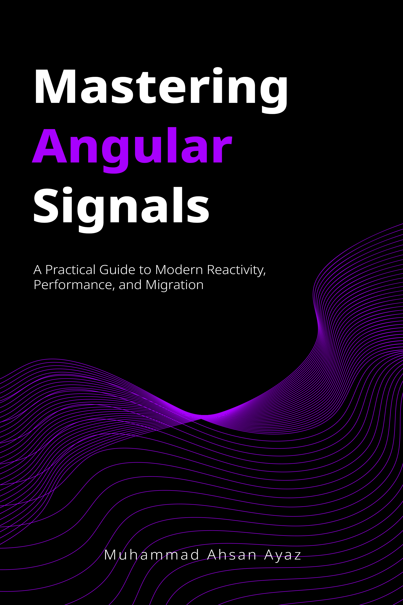

# Angular Signal Forms (v22) - work-along demo

Companion app for the "Angular Signal Forms Tutorial" video. You build it up one step at a
time, with an AI agent, exactly like in the video.

---

## 📚 Mastering Angular Signals

<a href="https://leanpub.com/mastering-angular-signals/c/V22LAUNCH?utm_source=github&utm_medium=readme&utm_campaign=v22-launch" target="_blank">
  
</a>

This demo is companion code for **Mastering Angular Signals**, the focused, v22-current guide to
reactive Angular: Signals for state, performance, and a step-by-step Observables to Signals
migration, with a foreword from the Angular team.

👉 **[Get it on Leanpub (launch price, DRM-free PDF + EPUB)](https://leanpub.com/mastering-angular-signals/c/V22LAUNCH?utm_source=github&utm_medium=readme&utm_campaign=v22-launch)** - also in **[paperback on Amazon](https://www.amazon.com/dp/B0FF9LSHJN/)**.

What you will learn:

- ⚡ Core reactive APIs: `signal`, `computed`, `effect`, `linkedSignal`
- 📡 Declarative async: `resource`, `rxResource`, `httpResource`
- 📋 Modern forms: schema-validated Signal Forms
- 🛠️ Seamless migration: Observables to Signals, step by step
- 🚀 Zoneless architecture and change-detection performance

---

## Work along with me

1. Clone this repo and check out the `start` branch (scaffold only):
   ```bash
   git checkout start
   npm install
   ng serve
   ```
2. Open the repo in **Claude Code** or **Gemini CLI / Antigravity**. Everything the agent needs
   ships in this repo (`.video-steps/`, `.claude/`, `.gemini/`), so there is nothing global to
   install.
3. Watch the matching part of the video, then tell the agent:
   ```
   run step 1
   ```
   It applies that step's code and writes a short `STEP-1-EXPLAINED.md`. In Gemini you can also
   use `/run-step 1`.
4. Repeat "run step 2" ... "run step 6". After step 6 the app matches the finished `main` branch.

Each step maps to a section of the video: 1 the form signal + `[formField]`, 2 validators +
errors, 3 watching changes, 4 confirm-password (cross-field), 5 submit, 6 nested + array fields.

---

This project was generated using [Angular CLI](https://github.com/angular/angular-cli) version 22.0.4.

## Development server

To start a local development server, run:

```bash
ng serve
```

Once the server is running, open your browser and navigate to `http://localhost:4200/`. The application will automatically reload whenever you modify any of the source files.

## Code scaffolding

Angular CLI includes powerful code scaffolding tools. To generate a new component, run:

```bash
ng generate component component-name
```

For a complete list of available schematics (such as `components`, `directives`, or `pipes`), run:

```bash
ng generate --help
```

## Building

To build the project run:

```bash
ng build
```

This will compile your project and store the build artifacts in the `dist/` directory. By default, the production build optimizes your application for performance and speed.

## Running unit tests

To execute unit tests with the [Vitest](https://vitest.dev/) test runner, use the following command:

```bash
ng test
```

## Running end-to-end tests

For end-to-end (e2e) testing, run:

```bash
ng e2e
```

Angular CLI does not come with an end-to-end testing framework by default. You can choose one that suits your needs.

## Additional Resources

For more information on using the Angular CLI, including detailed command references, visit the [Angular CLI Overview and Command Reference](https://angular.dev/tools/cli) page.
